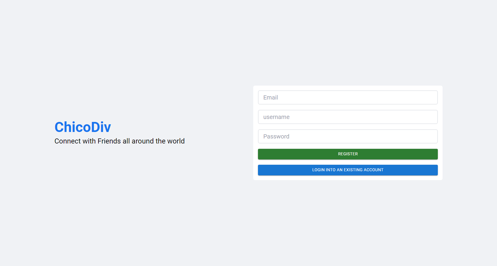
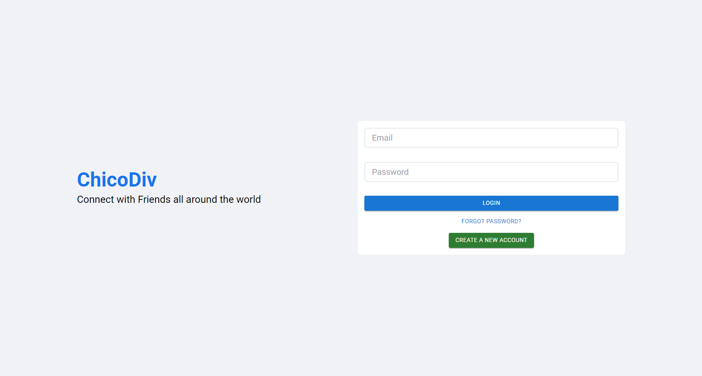
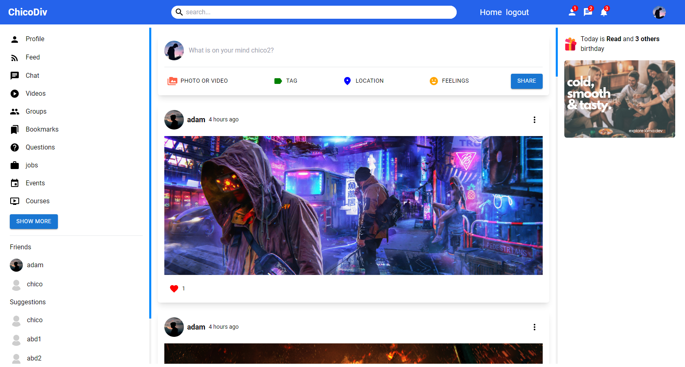

# Social Media App (facebook clone)

a social media app for adding friends sharing posts and interacting with them

- Website - [https://divchico.github.io/shoes-store/](https://divchico.github.io/shoes-store/)

## Table of contents

- [What the app dose](#What-the-app-dose)
- [Screenshots](#screenshots)
- [Built with](#built-with)
- [Author](#author)

### What the app dose

- create a new account
- login to an existing account
- add a profile picture and cover picture
- add more info about yourself
- follow friends
- Share posts
- like posts
- delete posts
- scroll through the feed

### Screenshots

### Built with

- react js
- javascript
- HTML
- CSS custom properties
- tailwind css
- Desktop-first workflow
- material-ui
- material-icons

## Author

- Website - [Abdullah hamdy Alatawwna](http://chicodiv.com/)
- Github - [Abdullah hamdy Alatawwna](https://github.com/DivChico)

### License

This project is available for use under the MIT License.
